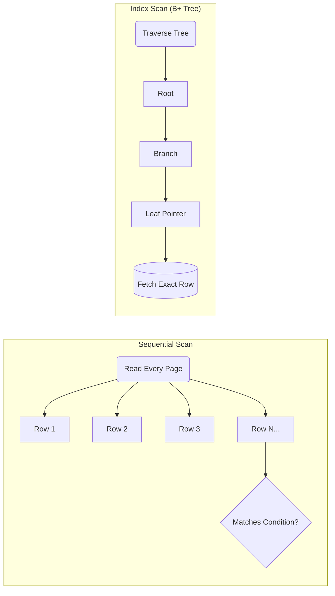
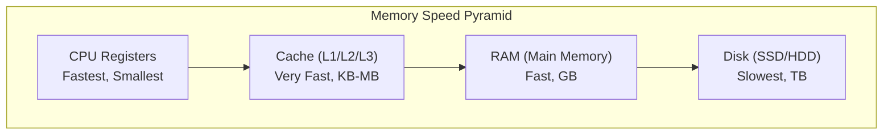
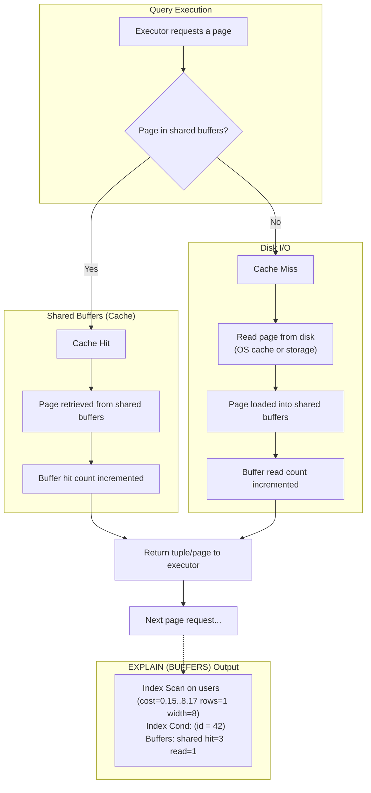
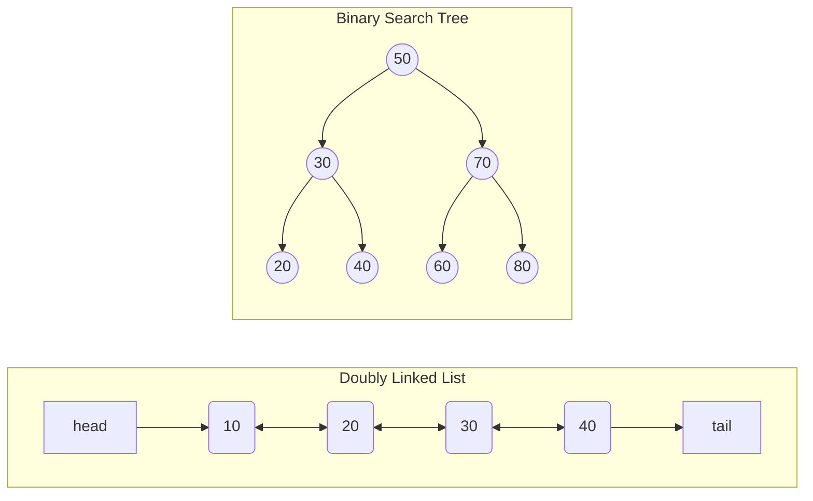
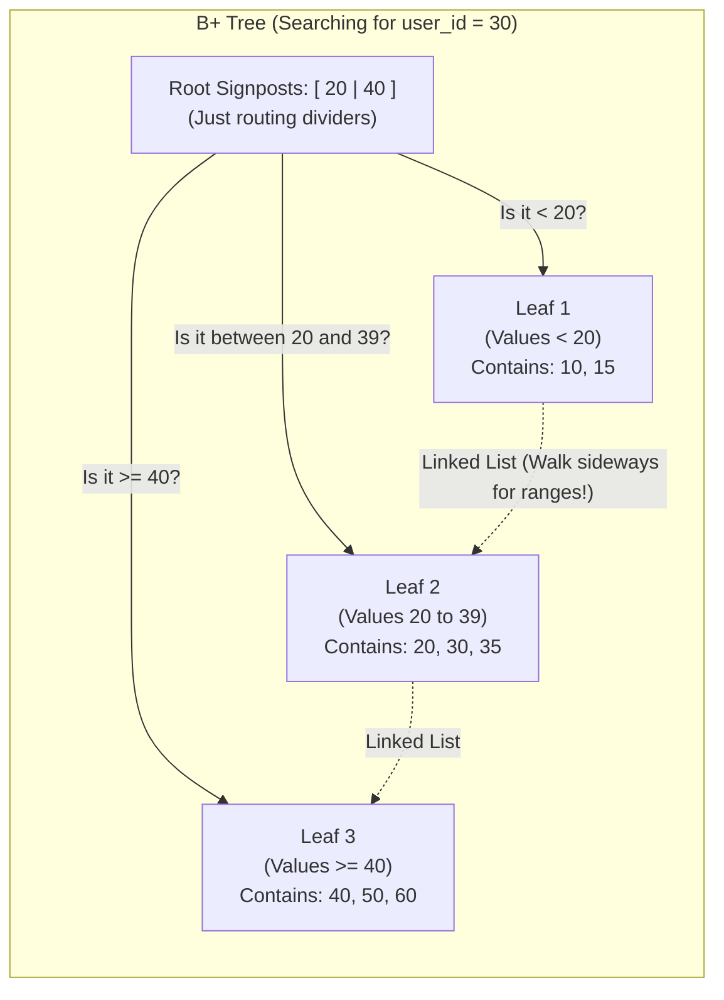
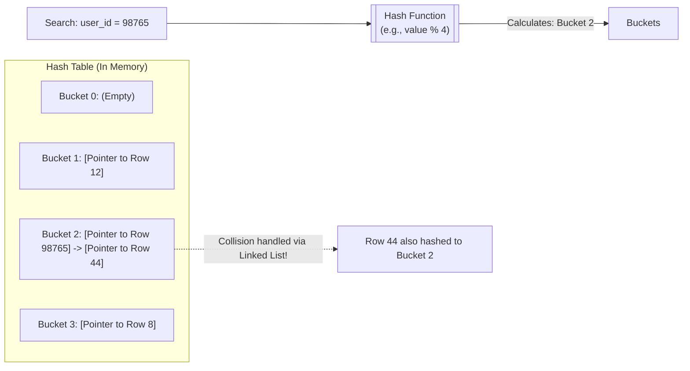
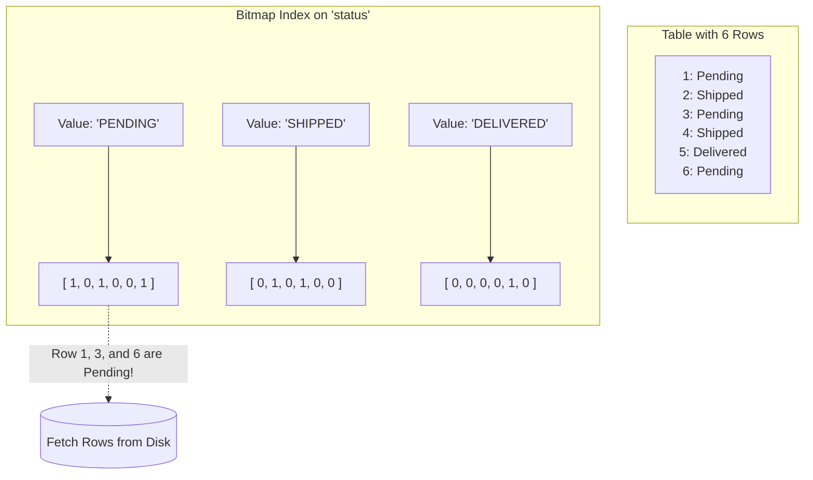
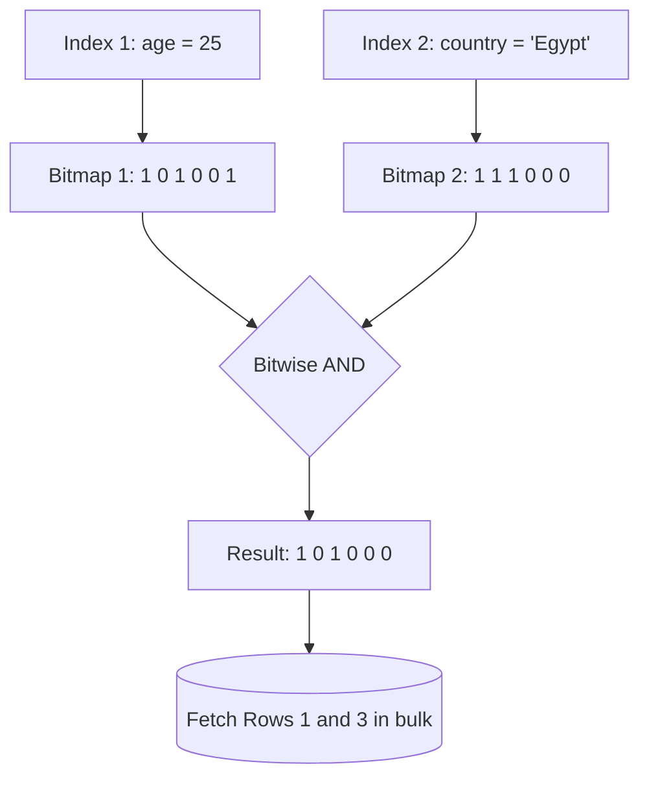

# Database Performance Engineering: Indexing & Partitioning

**From Theory to Real-World Execution**

---

## 1. Introduction: The Need for Speed

**The Problem:**
You built an app for a graduation project or a startup. It went viral. Now your database has 5 million records.
Suddenly, a simple query takes 4 seconds instead of 40 milliseconds. Your API is timing out.

**Example Table:**

```sql
CREATE TABLE products_wide (
    id BIGSERIAL PRIMARY KEY,
    name VARCHAR(200),
    category_id INT,
    brand_id INT,
    price NUMERIC(10,2),
    rating NUMERIC(3,2),
    created_at TIMESTAMP,
    is_active BOOLEAN,

    weight NUMERIC,
    dimensions VARCHAR(100),
    warranty_months INT,
    supplier_id INT,
    manufacturing_country VARCHAR(50),

    -- BIG TEXT COLUMN
    long_description TEXT
);

```

> If we just create an index on every single column in the table, will all our queries always become faster? (Hold your answers, we'll come back to this!)

---

## 2. Point vs. Range Queries

Different queries benefit from different index strategies.

**Point Query:**

```sql
SELECT * FROM orders WHERE user_id = 100;

```

* Returns one or a few specific rows.
* Best served by: B-Tree or Hash index.

**Range Query:**

```sql
SELECT * FROM orders WHERE created_at BETWEEN '2024-01-01' AND '2024-02-01';

```

* Returns many rows within a specific boundary.
* Requires: B-Tree index (Hash indexes cannot support this).

**Golden Rule of Indexing:** *Design indexes based on your query patterns, not just your table schema.*

---

## 3. What Is an Index?

Think of a database index exactly like the **index at the back of a massive textbook**.

* **Without an index (Full Table Scan):** To find all mentions of "Concurrency", you have to read the textbook page by page from the beginning. In databases, this is an expensive, slow process (O(N)).
* **With an index (Index Scan):** You flip to the back, find "Concurrency: pages 42, 115", and jump directly to those specific pages.

**Engineering Intuition:**
An index is a separate data structure (usually a tree) that stores a copy of specific columns in a sorted manner, pointing directly to the exact row locations on disk.

---

## 4. Index vs Filter

**1. Index Cond (The GPS)**

* The database uses the index to jump directly to the matching rows.
* It only reads the exact data it needs from the disk.
* **Fast.**

**2. Filter (The Bouncer)**

* The database has already fetched the row from disk into memory.
* It evaluates a `WHERE` condition on the row. If it fails, it throws the row in the trash.
* **Slow and wasteful** (reads data it doesn't need).
 
---

## 5. Visualizing Scans: Sequential vs. Index



* **Sequential Scan:** Reads the whole disk. Bad for finding one user, but actually *faster* if you need to read 90% of the table.
* **Index Scan:** O(log N) tree traversal. Incredible for finding a needle in a haystack.

---

## 6. Execution Plans: Decoding `EXPLAIN ANALYZE`

Backend engineers don't guess. We measure.
Always run queries with `EXPLAIN (ANALYZE, BUFFERS)` to see exactly what the database did.

> Take Care: `ANALYZE` keyword enforces the execution!

**Rule #1: Read the plan from the inside-out, bottom-up.** The most indented nodes at the bottom are executed first.

```text
->  Index Scan using idx_products_category on products 
      (cost=0.42..154.32 rows=1200 width=44) (actual time=0.045..3.201 rows=1250 loops=1)
      Index Cond: (category_id = 5)
      Buffers: shared hit=400 read=15

```

### Decoding the Metrics

* **`cost=0.42..154.32`**: This is **NOT** milliseconds. It is an arbitrary mathematical score of disk/CPU effort.
* `0.42` = Startup cost (effort to get the very first row).
* `154.32` = Total cost (effort to get all rows).


* **`rows=1200` vs. `actual rows=1250`**: The optimizer's *guess* versus *reality*. If these numbers are vastly different, your database statistics are outdated (run `ANALYZE table_name;`).
* **`actual time`**: The real execution time in milliseconds.
* **`loops=1`**: How many times this specific step was executed. (A nested loop join might show `loops=5000`—a huge red flag!)
* **`Buffers`**: The absolute truth of disk I/O.
* `shared hit=400`: Pages read directly from fast RAM (Cache).
* `read=15`: Pages fetched from the slow hard drive (disk I/O).
> What's 'page'? It's a memory block. The memory is chunked virtually by the OS into pages/frames.

### What is cache?
A type of memory.




### Common Scan Types You Will See

When reading the plan, look for these keywords to understand the database's strategy:

* **Seq Scan:** Full table scan. Reading every page on disk. Bad for finding one row, fine for reading 90% of a table.
* **Index Scan:** Traverses index, finds the disk pointer, then fetches the physical row from the table.
* **Index Only Scan:** The Holy Grail. The index contains all requested columns. The database never touches the main table!
* **Bitmap Index/Heap Scan:** Sweeps one or more indexes first, builds a memory map (bitmap) of where the rows live, then fetches them from the table in bulk.

### Demo 1.

---

## 7. How Databases Use Indexes

You don't tell the database *how* to execute a query. You tell it *what* you want (SQL is declarative). The **Query Optimizer** decides the rest.

* **Cost-Based Optimization (CBO):** The database calculates the "cost" (CPU, memory, disk I/O) of different execution plans and picks the cheapest one.
* **Table Statistics:** The database keeps track of data distribution (e.g., "Are most orders 'pending' or 'shipped'?").
* **Selectivity:** An index is highly selective if it narrows results down to a very small percentage of rows.

---

## 8. Types of Indexes

Different data structures solve different lookup problems.

* **B-Tree (Balanced Tree):**
  - *The Default.* Handles almost all workloads.
  - Great for equality (`=`) and range queries (`<`, `>`, `BETWEEN`).
  - Maintains sorted order.

* **Hash Indexes:**
  - Designed exclusively for equality lookups (`=`).
  - Cannot support range queries.
  - Rarely used in practice because B-trees handle equality efficiently for most use cases. 
  - > PostgreSQL’s hash indexes were historically not crash‑safe until version 10; now they are, but B‑trees remain the default due to versatility. 

* **Bitmap:**
  - Extremely space‑efficient for low‑cardinality (small-number-of-possible-values) columns.
  - > PostgreSQL does not have native bitmap indexes; the “Bitmap Index Scan” in an execution plan means it built a bitmap on the fly from a B‑Tree index. Native bitmap indexes (like Oracle’s) are stored persistently and are ideal for low‑cardinality columns, but they are not available in PostgreSQL.

* **Others! (Specialized Indexes):**
Relational databases have evolved to handle complex data structures beyond simple strings and numbers.
  - Vector / AI Indexes (HNSW, IVFFlat): Essential for modern machine learning applications. Used to perform similarity searches on high-dimensional vector     embeddings (e.g., retrieving similar chest X-rays or semantic text search) using extensions like pgvector.

  - Spatial / Geographic Indexes (R-Tree, QuadTree, GiST): Used for GIS (Geographic Information Systems). Perfect for spatial math queries like, "Find all restaurants within a 5km radius of this GPS coordinate."

  - Inverted Indexes (GIN): The backbone of search engines. Used heavily in PostgreSQL for fast Full-Text Search and for querying deep inside unstructured JSON documents (JSONB).

  - Block Range Indexes (BRIN): Extremely lightweight indexes designed for massive, append-only time-series tables (like millions of IoT sensor logs). They index blocks of pages rather than individual rows.

---

## 9. Visualizing the B-Tree (Balanced Tree)

### The Standard B-Tree (The Theory)

**A standard B-tree of order *m* obeys these mathematical rules:**

* **Capacity:** Every node has at most *m* children.
* **Minimums:** Every internal node has at least $\lceil m/2 \rceil$ children.
* **Root:** The root node has at least 2 children (if it's not a leaf).
* **Key Ratio:** A non-leaf node with *k* children contains *k-1* keys.
* **Balance:** All leaves are on the exact same level.

> **The Catch:** In a standard B-tree, **every node** (root, internal, and leaf) contains actual data pointers.
---
### Pre-requisites:

---

### B-Tree vs. B+ Tree (The Reality)

When PostgreSQL or MySQL says "B-Tree", they actually mean **B+ Tree**.



**Why Databases Use B+ Trees:**

1. **Smaller Internal Nodes:** Since routing nodes don't hold heavy row pointers, more of the tree fits into a single RAM page.
2. **The Linked List:** The leaves form a doubly linked list. Queries like `WHERE age BETWEEN 20 AND 50` drop down to `20` once, then just sweep sideways!

---

## 10. Visualizing the Hash Index

### How it works: The database runs the search value through a mathematical function to instantly calculate the exact "bucket" (array slot) where the disk pointer lives. $O(1)$ lookup time!

> **The Catch:** Because hashing scrambles the sorting order, if you ask for `user_id > 100`, the database has no idea which buckets to look in. It only works for exact equality (`=`).



---

## 11. Visualizing the Bitmap Index

### How it works: Instead of storing a heavy disk pointer for every single row, it stores one single bit (`1` or `0`) for every row in the table (Creating a bit vector for each value the column may contain).

> Low Cardinality column means a small number of possible values for the column.
> **Why it's genius for Low Cardinality:** 
> If you have 50 million users, a B+ tree storing the status would be massive. A Bitmap index just stores a 50-million-bit string (which compresses down to a few megabytes!). This is why they are the absolute king for analytics and data warehousing.



## Demo 2.

---

## 12. Composite Indexes

A multi-column index operates like a phone book sorted by `(Last Name, First Name)`.

```sql
CREATE INDEX idx_user_date ON orders(user_id, created_at);

```

**The Left-Prefix Rule:**
The index is only useful if your query filters on the leftmost columns.

* ✅ `WHERE user_id = 5` (Uses index)
* ✅ `WHERE user_id = 5 AND created_at > '2023-01-01'` (Uses index beautifully)
* ❌ `WHERE created_at > '2023-01-01'` (Cannot use this index effectively! Like searching a phone book by First Name only).

**Column Ordering Matters:** Put the most restrictive (selective) columns first, or the columns used in equality checks before columns used in range checks.

---

## 13. Covering Indexes and Index-Only Scans

What happens when an index has *everything* the query needs?

```sql
CREATE INDEX idx_user_amount ON orders(user_id, amount);

```

**The Query:**

```sql
SELECT amount FROM orders WHERE user_id = 98765;

```

**Index-Only Scan:** The database finds `user_id = 98765` in the index. Since `amount` is *also* right there in the index structure, the database **never actually looks at the table data on disk**. It skips the "heap lookup" entirely. This is the holy grail of read performance.

> Advanced: PostgreSQL supports INCLUDE clauses (since v11) to add non‑key columns to an index without affecting the left‑prefix rule—great for covering indexes without bloating the B‑tree key.

### Demo 3.

### Demo 4.

**Conclusions**:
   - `INCLUDE` adds payload columns only at the leaf level, so they don’t affect sorting or the left‑prefix rule.
   - Ideal for covering indexes where you need extra columns but don’t want to enlarge the key.
   - Available since PostgreSQL 11.
---

## 14. Partial Indexes:

The index is tiny and extremely fast for queries that only need pending orders, but ignored for other statuses.
```sql
CREATE INDEX idx_orders_pending ON orders(user_id) WHERE status = 'pending';
```

### Demo 5.

**Conclusions**:
   - Partial indexes save space and maintenance overhead.  
   - The optimizer only considers them when the `WHERE` conditions match.  
   - Great for workloads that always filter by a constant (e.g., active vs. archived).

---

## 15. Combining Indexes (Bitmap Index Scan)

What if we have two separate indexes? Let's say we want to find 25-year-olds in Egypt.



Modern databases (like PostgreSQL) use Bitwise logic in memory to intersect the results of multiple indexes *before* touching the disk.

### Demo 6.

---

## Hands-On!

---

## 16. When Indexes Are Not Used

Sometimes you create an index, but the database ignores it. Why?

1. **Very Low Selectivity:** An index on a boolean `is_deleted` column. If 98% of rows are `false`, scanning the index is a waste of time.
2. **Small Tables:** If a table fits entirely in memory, a sequential scan is simply faster than navigating a tree.
3. **Outdated Statistics:** If the database *thinks* a table is empty because statistics haven't been updated (e.g., `ANALYZE` hasn't run), it will make bad execution choices.
4. **Applying Functions to Indexed Columns:** * ❌ `WHERE EXTRACT(YEAR FROM created_at) = 2023` destroys index usage because the function must evaluate every row.
* ✅ Fix: `WHERE created_at >= '2023-01-01' AND created_at < '2024-01-01'`.
> Expression Indexes: CREATE INDEX idx_lower_email ON users(LOWER(email));

### Demo 7.

**Conclusion**:  
   - Functions on indexed columns break index usage unless you index the expression.  
   - Expression indexes store pre‑computed values, so they work for equality and range if the result is sortable.  
   - They add overhead on writes, so use sparingly.

---

## 17. Partitioning

When a table gets so large that even indexes no longer fit in memory, we use partitioning to break it into smaller, manageable chunks.

### Vertical vs Horizontal:
* **Vertical Partitioning**:
  - When most of the queries require some columns more than the others. (Like the products_wide table in our demo database)
  - Made in the design, no special syntax in most engines.
* **Horizontal Partitioning**:
  - When the count of rows grow up.
  - Not a must to be on the primary key.
  - '**Sharding**' is the term used in distributed systems.

**Example: Partitioning by Range (PostgreSQL)**

First, define the parent table:

```sql
CREATE TABLE news (
    id SERIAL,
    title TEXT,
    published_at DATE
) PARTITION BY RANGE (published_at);

```

Then, create the partitions:

```sql
CREATE TABLE news_2023 PARTITION OF news FOR VALUES FROM ('2023-01-01') TO ('2024-01-01');
CREATE TABLE news_2024 PARTITION OF news FOR VALUES FROM ('2024-01-01') TO ('2025-01-01');

```

**Partition Pruning:** If a query asks for news from `2024-05-01`, the optimizer completely ignores the `news_2023` table on disk.

### Demo 8.

### Demo 9.

---

## 18. Cross-Database Perspective

Not all databases behave exactly the same way.

* **PostgreSQL:** Strictly relies on its heavily optimized Cost-Based Optimizer. It does not natively allow "Index Hints" (forcing the DB to use a specific index). It's not friendly with the 'Hints' in the query level (support some of them in session level, where you can discourage the optimizer to behave somehow).
* **MySQL (InnoDB):** Uses clustered indexes (the primary key *is* the table). Allows `USE INDEX` or `FORCE INDEX` hints if you think you are smarter than the optimizer.

---

## 19. Summary

Remember the question from the beginning? *If we create an index on every column, will queries always become faster?*

**No.** Because **indexes accelerate reads, but slow down writes** (the DB must update the index tree on every `INSERT`, `UPDATE`, or `DELETE`).

* **Watch your left-prefix:** Multi-column indexes are strictly ordered.
* **Execution Plans are your best friend:** Use `EXPLAIN ANALYZE` to prove your index works.
* **Design for queries, not schemas:** Understand your app's `WHERE`, `ORDER BY`, and `JOIN` clauses.
* **Partitioning scales the unscalable:** Use it when your indexes outgrow your server's RAM.
> Remember: **Golden Rule of Indexing:** *Design indexes based on your query patterns, not just your table schema.*

---

## Closing Example Queries (Optional, if time permits)

```sql
-- Demo: **Index Bloat and Maintenance**  
--Objective: Show that indexes can bloat over time and need maintenance, and that `VACUUM` and `REINDEX` help.  
-- Context: Use a test table, e.g., `users_log`, after many updates or deletes.  

DROP TABLE IF EXISTS bloat_test;

-- Create a test table
CREATE TABLE bloat_test (id serial primary key, payload text);
CREATE INDEX idx_bloat_test_id ON bloat_test(id);

-- Insert 100k rows
INSERT INTO bloat_test (payload) SELECT 'item ' || g FROM generate_series(1,100000) g;

-- Check index size
SELECT pg_size_pretty(pg_relation_size('idx_bloat_test_id'));

-- Simulate many random updates (creates dead tuples)
DO $$
BEGIN
FOR i IN 1..100000 LOOP
    UPDATE bloat_test SET payload = payload || 'x' WHERE id = floor(random()*100000+1);
END LOOP;
END $$;

-- After updates, check index size again (likely larger due to bloat)
SELECT pg_size_pretty(pg_relation_size('idx_bloat_test_id'));

-- Reindex to compact
REINDEX INDEX idx_bloat_test_id;

-- Check size after reindex (should be smaller)
SELECT pg_size_pretty(pg_relation_size('idx_bloat_test_id'));
```
**Conclusions**:  
   - Indexes store pointers to dead rows until cleaned up.  
   - Bloat increases disk usage and can degrade performance.  
   - Regular maintenance (autovacuum) mitigates this, but sometimes manual intervention is needed.  
   - Monitoring index bloat with queries like:
     ```sql
     SELECT schemaname, tablename, indexname, pg_size_pretty(pg_relation_size(indexrelid)) 
     FROM pg_stat_user_indexes;
     ```
---

```sql
-- Demo: The Grand Finale Demo: The Cost of Over-Indexing

DROP TABLE IF EXISTS users_log;

-- Create a fresh table with NO indexes (except the primary key)
CREATE TABLE users_log (
    id SERIAL PRIMARY KEY,
    username VARCHAR(50),
    action VARCHAR(50),
    ip_address VARCHAR(50),
    status VARCHAR(20),
    created_at TIMESTAMP
);

-- Insert 100,000 rows
EXPLAIN ANALYZE 
INSERT INTO users_log (username, action, ip_address, status, created_at)
SELECT 
    'user_' || gs, 
    'login', 
    '192.168.1.' || (gs % 255), 
    'success', 
    NOW()
FROM generate_series(1, 100000) gs;

CREATE INDEX idx_log_username ON users_log(username);
CREATE INDEX idx_log_action ON users_log(action);
CREATE INDEX idx_log_ip ON users_log(ip_address);
CREATE INDEX idx_log_status ON users_log(status);
CREATE INDEX idx_log_created_at ON users_log(created_at);

EXPLAIN ANALYZE 
INSERT INTO users_log (username, action, ip_address, status, created_at)
SELECT 
    'user_' || gs, 
    'login', 
    '192.168.1.' || (gs % 255), 
    'success', 
    NOW()
FROM generate_series(100001, 200000) gs;
```

